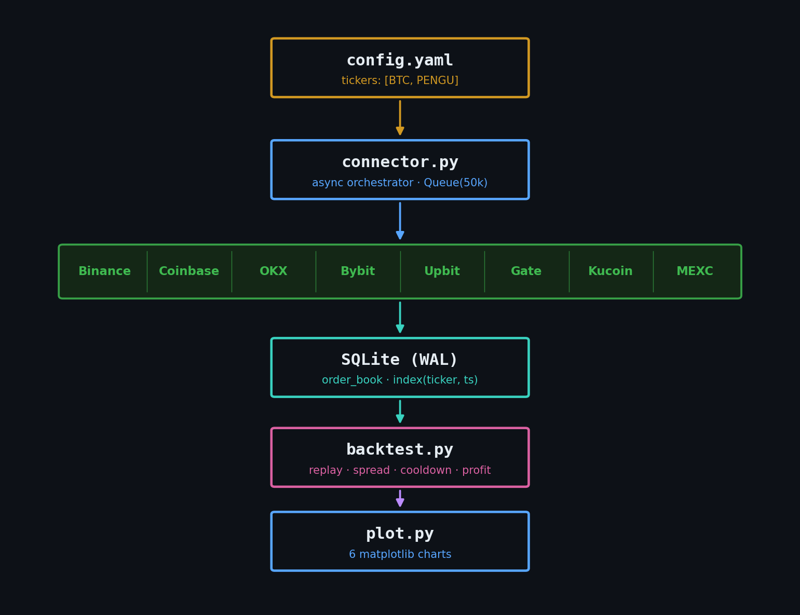
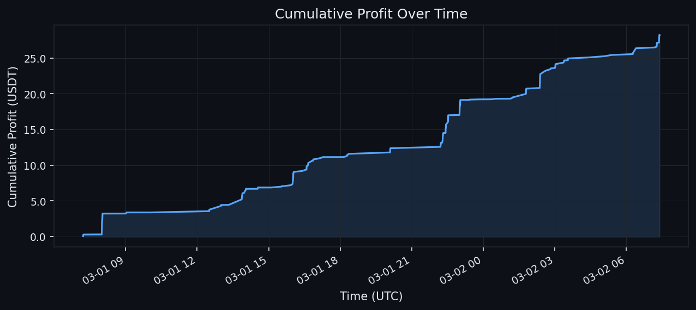
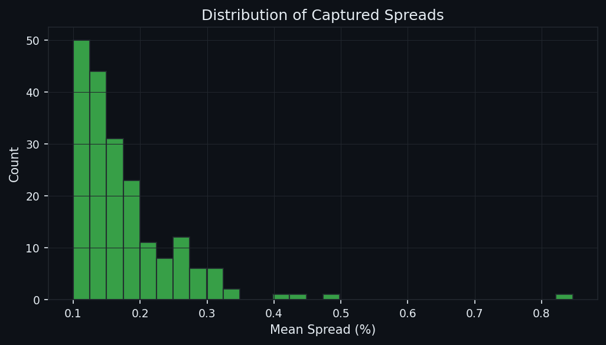
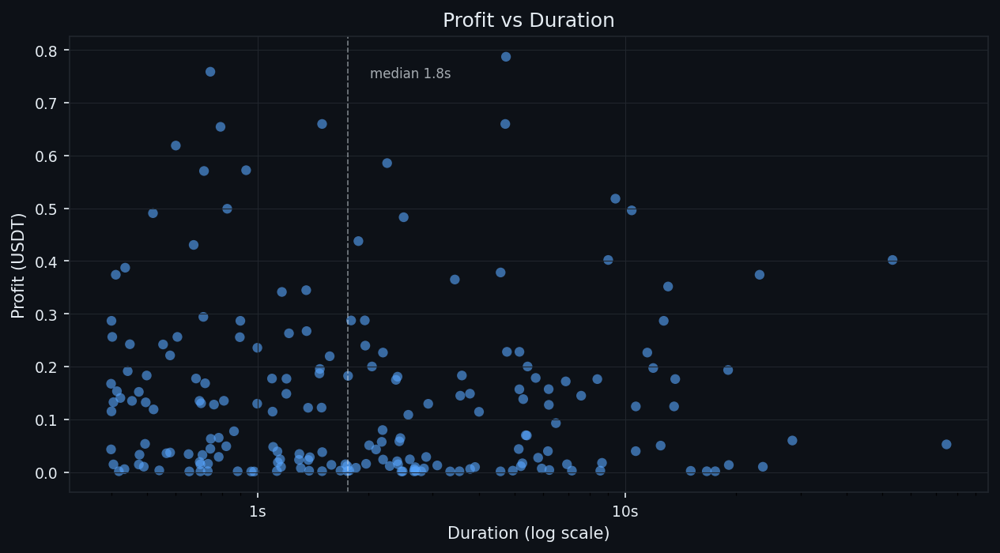
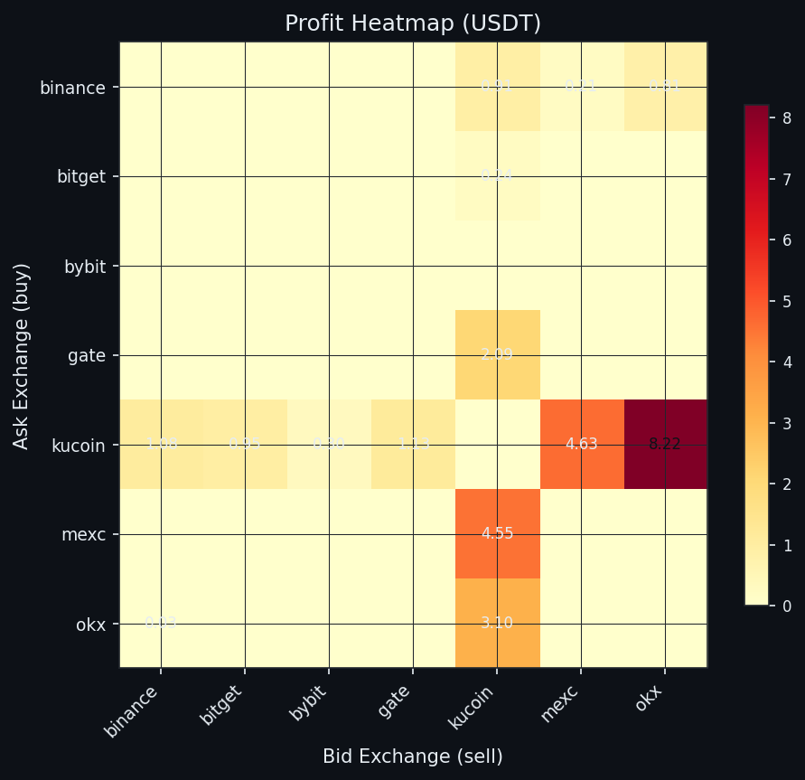
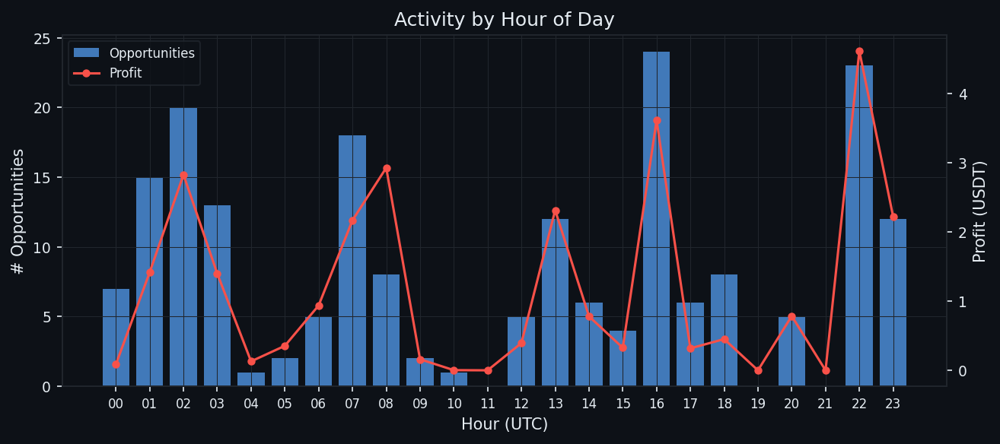
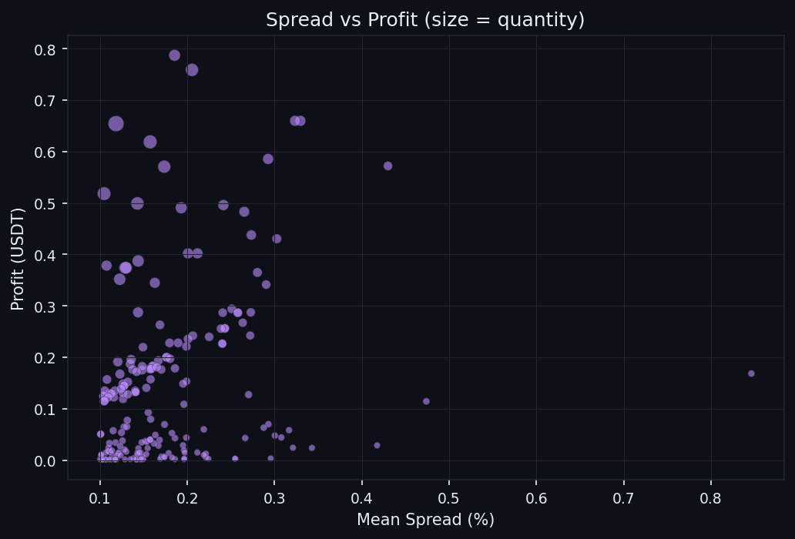

# cex_arb

Cross-exchange arbitrage research project. Collects real-time order book data from 9 CEX via WebSocket and replays it through a tick-by-tick backtest to identify taker/taker arbitrage opportunities.

## Architecture



## Strategy

**Taker/Taker only.** When the best bid on exchange A (net of fees) exceeds the best ask on exchange B (net of fees), both sides are executed as market orders simultaneously.

The backtest applies few filters to avoid reporting noise:

- **MIN_DURATION_MS** (400ms) : opportunity must persist across time, not just a single tick
- **MIN_OBS** (10) : minimum number of confirming ticks within the window
- **COOLDOWN_MS** (10s) : after a trade, both involved exchanges are blocked to simulate liquidity impact
- **MIN_MEAN_PCT** (0.1%) : opportunities below this net spread are discarded. This threshold is a rough estimate, not derived from backtesting; a dedicated sensitivity analysis could determine the true minimum viable spread

Profit is estimated at the p80 spread tick within each opportunity window.

## Quickstart

```bash
python3.13 -m venv venv
source venv/bin/activate
pip install -r requirements.txt

# 1. Collect order book data (runs indefinitely)
make fetch

# 2. Run backtest on collected data
make backtest

# 3. Generate plots
make plot
```

## Sample Results

24 hours of PENGU/USDT data: **197 opportunities**, **28.24 USDT** total profit (with no frontrun or latency modeling).

### Cumulative Profit



This is a best-case scenario since the backtest does not model slippage, latency, or failed fills.

### Spread Distribution



Most captured spreads (already net of fees) fall between 0.1% and 0.2%.

### Profit vs Duration



No clear correlation. Profitable opportunities appear on both short (<1s) and long (3-5s) windows. Median duration is 1.8s.

### Profit Heatmap



Kucoin dominates both sides. The main hotspot is Kucoin to OKX (8.22 USDT), followed by Mexc to Kucoin (4.55 USDT). The matrix is asymmetric : buying on Kucoin and selling on OKX is significantly more profitable than the reverse, indicating a systematic pricing bias on Kucoin for PENGU on the 24h timeframe evaluated.

### Activity by Hour



Peaks at 02h, 07h, 16h and 22h UTC. Profit per hour does not always track opportunity count (08h has few opportunities but high profit).

### Spread vs Profit



Bubble size represents traded quantity. The largest profits come from moderate spreads (0.10-0.20%) combined with high available quantity, not from extreme spreads. Top-of-book liquidity is the primary limiting factor.

## Tests

```bash
make test
```

- **Unit tests** : spread calculation, exchange selection, profit computation, opportunity evaluation.
- **Integration tests** : positive/negative spread detection, JSON output, cooldown logic.
- **Protobuf tests** : varint encoding/decoding, nested structures, edge cases.

## Exchanges

| Exchange | Taker Fee |
|----------|-----------|
| Binance  | 0.10%     |
| OKX      | 0.10%     |
| Bybit    | 0.10%     |
| Kucoin   | 0.10%     |
| Gate     | 0.10%     |
| Mexc     | 0.05%     |
| Coinbase | 0.60%     |
| Bitget   | 0.10%     |
| Upbit    | 0.25%     |

All connectors share the same interface: `async stream(tickers, queue)`. Mexc is the only exchange using protobuf over WebSocket.

## Database Choice

SQLite offers a single portable file, transactional consistency, and minimal setup. Columnar formats (Parquet) would suit larger-scale pipelines but add complexity beyond the scope of this project.

## Known Limitations

This is a research/feasibility project, not a production trading system.

- **No slippage model** : assumes execution at exact quoted top-of-book prices
- **No latency simulation** : real execution takes 50-200ms; MIN_DURATION_MS partially compensates
- **No frontrun modeling** : assumes every detected opportunity is fillable
- **No inventory rebalancing** : ignores the cost of moving funds between exchanges
- **Taker-only**: implementing a maker/taker strategy would require accurately modeling order placement, cancellations, rate limits, and detailed trade data. Even with more data, such modeling would remain unreliable. For example, if we place a limit order at the top of the book, a backtest might simulate it as partially filled when a trade occurs in the replayed data. In reality, however, another market maker could easily step ahead of our order, tightening the spread and leaving our order unfilled.

## TODO

- **Edge duration modeling** : regression or survival analysis to estimate how long a spread remains exploitable as a function of spread size, volume, hour, and exchange pair
- **Frontrun modeling** : collect real-time trade data to estimate the probability that someone fills the opportunity before us
- **Latency simulation** : measure real WebSocket-to-execution round-trip per exchange and subtract it from opportunity windows
- **Sensitivity analysis on MIN_MEAN_PCT** : backtest across a range of thresholds to find the true minimum viable spread
- **Inventory rebalancing cost** : model the cost of periodically moving funds between exchanges to maintain trading capacity
